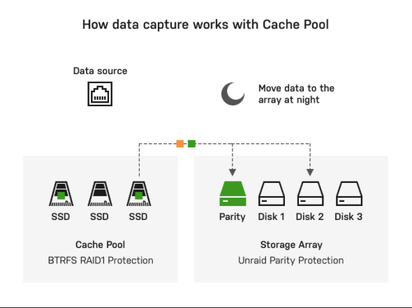
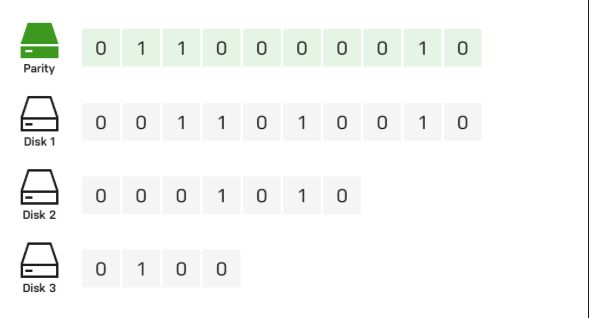
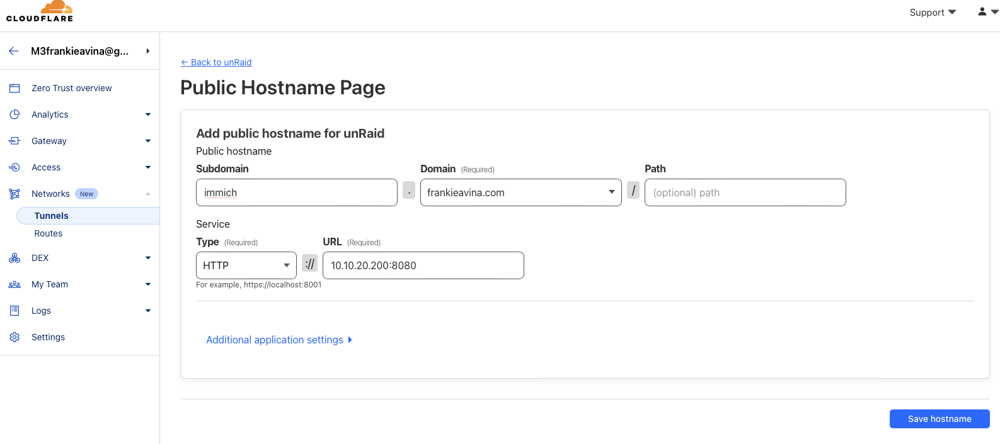
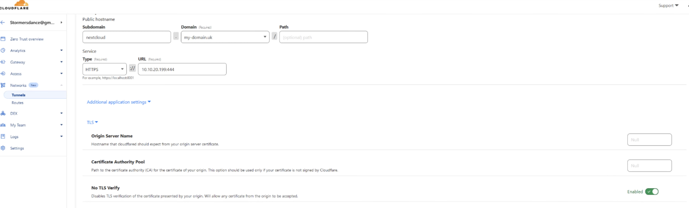
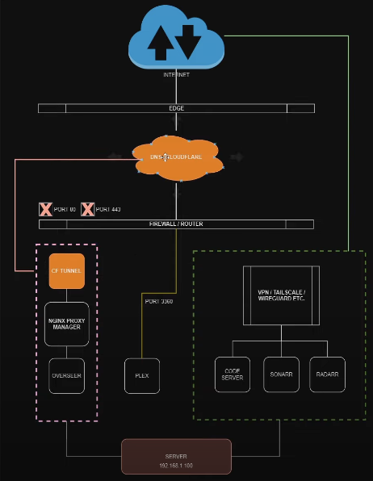
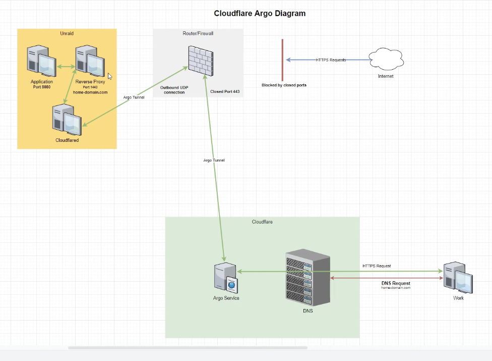

# UnRaid-OS-User-Guide

Brief description of your project. What does it do? Why is it useful?

## Table of Contents

- [Installation](#installation)
- [Usage](#usage)
- [Features](#features)
- [Contributing](#contributing)
- [License](#license)
- [Contact](#contact)

## Intro

At its core, Unraid is a hardware-agnostic solution that can turn almost any 64-bit capable system into a NAS. Unraid can manage an array of drives (connected via IDE, SATA, or SAS).

With unRAID , unlike traditional RAID-based technologies, it can scale on-demand by adding more drives without the need to rebalance the existing data. So essectially just pop your system add another hdd or sdd without the need to delete any existing data. 

Before I start here are some basic essential terminology that a user needs to know.

1. Disk array :

2. Cache pool: The cache drive feature of Unraid provides faster data intake.When data is written to a user share that has been configured to use the cache drive, all of that data is initially written directly to the dedicated cache drive. Because this drive is not a part of the array, the write speed is unimpeded by parity updates. Then, a scheduled mover process copies the data from the cache to the array at a time and frequency of your choosing (typically in the middle of the night). Once the mover completes, the space consumed previously on the cache drive is freed up.

3. User shares: To simplify manageability, the root user can create shares that allow files written to them to be spread across multiple drives. Each share can be thought of as a top-level folder on a drive. 

4. Parity-Protected Array: The primary purpose of an Unraid array is to manage and protect the data of any group of drives (JBOD) by adding up to two dedicated parity drives. A parity drive provides a way to reconstruct all of the data from a failed drive onto a replacement. The way the process works with a single parity drive is the parity disk and other disks perform a XOR function a bit level. If one disk fails the system performs an XOR function to determine the lost data(the bit) so it can add that data to the new drive that will replace the failed drive. 

* is a dash

## VMs in unRAID

We will be looking and using 2 shares that unRaid has already provided for us and that is : isos and domains.

When we create a VM it creates a virtual hard disk. And all the virtual hard disks created in unRaid are saved within the domains shares(folder). The isos shares are used to store all install media (eg. Windows11.iso file). 

So first we need to make the isos share available in our network. 

1. click onto isos 
2. Scroll down to export and change to Yes
3. We can add security to the share if we want click apply
4. isos share will be available on our network now 
5. create a new folder for each new type of install ( folder name: Linux )
6. Enable VM Manager by going to settings click on vm manager (make sure HVM and IOMMU are enabled)
7. download lates window virtIO driver git apply and done
8. click vms 
9. If passing through hardware, check the hardware you want to pass-through is in its own iommu group (If i want to run a dedicated GPU look at youtube video linked below)
[VM-GPU-Video]
(https://www.youtube.com/watch?v=RD6OWYJOIzU&list=PLlgoK-okRFaATYcnVdqpDqxoavNVnwMf4&index=7) 
10. install OS . Warning ethernet drivers may have not installed correctly so have to bypass online registration( shift+f10)
11. after logging in go to device manager and install ethernet by selecting the virtio disk and finding the driver (K..->w11 etc.)

## Remotely Access Server 

This section will explain the different ways to securely access an unRaid server remotely. Reasons to access a server remotely include : serving a web application to the web, controlling a docker container from any device outside our network, accessing a VM or container(our server) outside our network(phone, tablet, computer), sleeping and waking up a server remotely. 

The different types of ways to access our unRaid server is configuring a reverse proxy using nginx(SWAG or NPM), setting up a OpenVPN server on unRaid, and lastly using Cloudflare tunneling. 

### OpenVPN Server on Unraid 

An openvpn server will allow you to connect to the unRaid server, files and shares, anything on the network, and the internet through your home connection. 

* To get thing ready we need to forward port 1194 to our unRaid server's IP:
1. We need set our servers IP to static 
2. look into our routers software and port forward on port 1194 to the ip address of the server

* Install OpenVPN-AS Container 
1. go search for a container names openvpn as and install 
2. just leave all settings to default and check network type is set to bridge 

* Configure OpenVPN
1. click on openvpm container and open as webui 
2. login admin: admin password: password

follow the rest of the instruction on this video from 5:16 and beyond:
[OpenVPN]
(https://youtu.be/fpkLvnAKen0?si=SlAw9pnvKz5oHRgd) 

Note: WireGaurd is also a lightweight VPN server/client embedded in the linux kernel. Its fast to deploy and as secure as openvpn. You can learn more on how to implement it below.
[WireGaurd]
(https://unraid.net/blog/wireguard-on-unraid)

### Reverse Proxy using NGINX

SWAG - Secure Web Application Gateway (formerly known as LetsEncrypt, no relation to Let's Encrypt™) sets up an Nginx web server and reverse proxy with PHP support and a built-in certbot client that automates free SSL server certificate generation and renewal processes (Let's Encrypt and ZeroSSL). It also contains fail2ban for intrusion prevention. For more on SWAG her are some links below.
[SWAG_video_setup]
(https://youtu.be/N7FlsvhpVGE?si=siiPZyGib8bFDSrd)
[SWAG_guide_setup]
(https://docs.ibracorp.io/swag-2)

I ended up going with the NPM route (NGINX Proxy Manager).NGINX Proxy Manager enables you to easily forward to your websites running at home or otherwise, including free SSL, without knowing too much about NGINX or Letsencrypt. An excellent reverse proxy to help connect your services to the web. 

** Note ** 
Due to recent problems with my reverse proxy set up I deleted my instructions. I will update in the near future. But here is a link to resources that can help someone looking to set it up.
[NPM_ReverseProxy_with_IBRACORP]
(https://youtu.be/h1a4u72o-64?si=hZJQWHtFLKouhnXt)

### Cloudflare Tunnel

This is a great secure alternative to reverse proxy just incase you have some trouble doing a reverse proxy (open ports, restrictions with ISP)

1. Have or buy a custom domain of your choice
2. Sign up for cloudflare
3. Now we can add site and add our domain name and it will add it to our cloudflare
4. click continue and now it will scan my domain name at my registrar (porkbun, godaddy, etc) copy all the dns clonning it so when we point the nameservers to cloudflare it will match where it used to be 
5. Cloudflare will now give us the nameservers to add to where we registered our domain name 
6. Go back to your registrar and add the nameservers provided my cloudflare 
7. Wait for domain to be active on cloudflare 
8. We have to setup some billing (note you will not be charged anything) before we can use Zero Trust 
9. Now go to Zero Trust -> Networks -> Tunnels -> click on Add tunnels -> click Cloudflare tunnel -> give it a name (eg.unraid)
10. Choose environment in this case its Docker click on the script because we need the token 
11. Go to your  server -> apps -> install container called "Unraid-Cloudflared-Tunnel" and install your cloudflare token -> click apply

For the next instruction you can modify what container you want cloudflare tunnel to connect to for this example im using immich 

1. So what this needs is the address this connects to ( eg. 10.10.20.200:8080 ) which is the number on the port mapping on the right hand side of the arrows. You can also open the webui of the container youre trying to connect and the address will be on top of the search bar. 
2. Go back to cloudflare make sure the status is connected(or healthy)
3. Click on the 3 dot icon to configure -> public hostname tab -> click on add a public hostname button
4. add subdomain name , domain , path(optional), type, url , etc and save hostname 

5. type the domain name with the subdomain picked and boom! you are set !

To provide a more secure connection to have it join through https. Follow these next steps to do so: 
1. Go to cloudflare main page -> click on your domain name -> go to ssl/tls -> go to edge certificates
2. Scroll down to a section called " Always Use HTTPS " and enable it 
3. go back to the website (eg. pics.frankieavina.com ) it will redirect us through https 

Sometimes your container you already by default connects through https (nextCloud for example). You can check this by going to the WebUI and checking the url or the configurations and look at the webui url. With a container like that we need to do something slightly different in the cloudflare tunnel.  

1. First we get the ip address with the port number
2. Go back to cloudflare -> zero trust -> network -> tunnels -> add another root to the tunnel (click configure to add another route -> public hostname tab -> add a public hostname )
3. add your subdomain, domain url, type to https , add your url 
4. click additional application settings 
5. click on 'No TLS Verify' make sure its enabled 
6. click add hostname 

And that is how we set up a Cloudflare tunneling an alternative to reverse proxy. 

## Move Data in UnRaid

/mnt has all the of our unRaids disks and shares. For example, cache_nvme, cache_ssd, disk1, disk2, remotes, user/, vms_nvme etc. 

Here is the blueprint: 

As we can see with the method chosen we do not need any port open(port forwarding). Cloudflare is taking care of talking to our NGINX proxy manager and that is in charge of talking to our other apps (eg. overseer)